* GitHub is a development platform that enables you to host and review code, manage projects, and build software. 
* It provides the important DevOps features like planning features, fixing bugs, or collaborating on changes.

* [The GitHub flow](https://docs.github.com/en/get-started/quickstart/github-flow) - a workflow designed to optimize use of its various features. 

* [Git](https://docs.github.com/en/get-started/using-git) is a distributed version control system (DVCS) that allows multiple developers to work on a project. It provides a way to work with one or more local branches and push them to a remote repository. Git is responsible for everything GitHub-related that happens locally on your computer. Key features: It's installed and used on your local machine, Handles version control, Supports branching

* [GitHub](https://docs.github.com/en/free-pro-team@latest/github/getting-started-with-github) - is a cloud platform that uses Git as its core technology. Key features: Issues, Discussions, Pull requests, Notifications, Labels, Actions, Forks, Projects

* [Issues](https://guides.github.com/features/issues/) - are where most of the communication between a consumers and development. An issue may be bug reports, feature requests, documentation clarifications, and more. It can be assigned to owners, labels, projects, and milestones. You can also associate issues with pull requests and other GitHub items to provide future traceability.
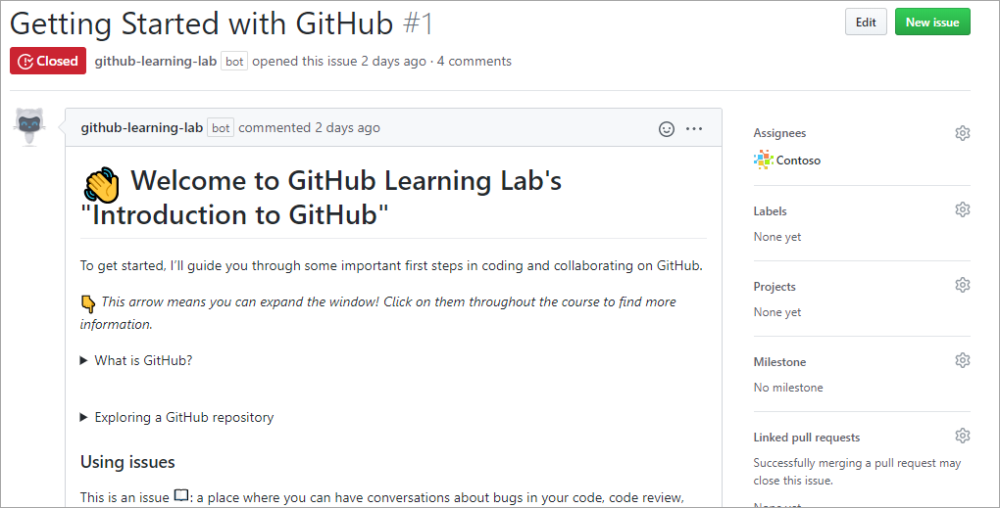

* [Notifications](https://help.github.com/github/managing-subscriptions-and-notifications-on-github/configuring-notifications) - for virtually every event that takes place within a given workflow. These notifications can be finely tuned to meet your preferences. To keep track of all of your notificationscts, use the [dashboard](https://github.com/notifications).
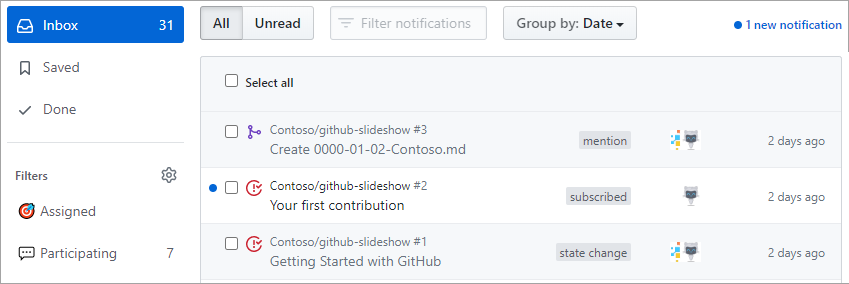

* [Branches](https://docs.github.com/pull-requests/collaborating-with-pull-requests/proposing-changes-to-your-work-with-pull-requests/about-branches) - create changes in the GitHub flow, so that multiple people may simultaneously work on the same code in a controlled way. It may be merged to main brach via pull request.


* [Commits](https://help.github.com/desktop/contributing-to-projects/committing-and-reviewing-changes-to-your-project) - is a change to one or more files on a branch. It provides a clear audit trail for anyone reviewing the history of a file or linked item, such as an issue or pull request.
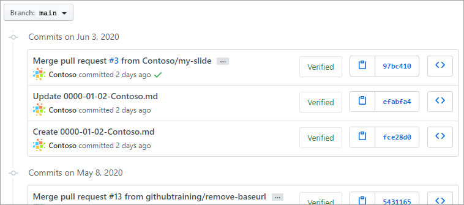

* [Pull Requests](https://help.github.com/github/collaborating-with-issues-and-pull-requests/about-pull-requests) - is the mechanism used to signal that the commits from one branch are ready to be merged into another branch. Reviewers to verify the code and approve the merge. Once the changes have been approved (if approval is required), the pull request's source branch (the compare branch) may be merged in to the base branch.
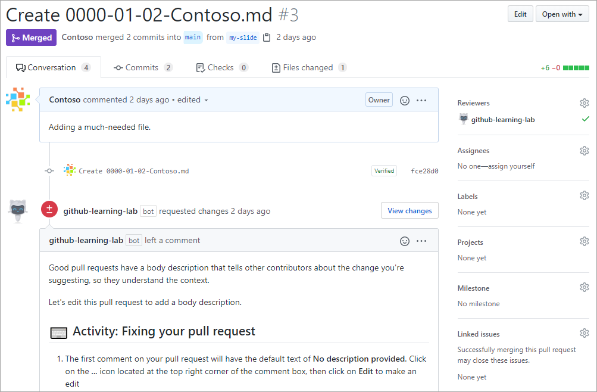

* [Labels](https://docs.github.com/en/free-pro-team@latest/github/managing-your-work-on-github/about-labels) - categorize and organize issues and pull requests in a repository. Examples of Labels: bug, documentation, duplicate, help wanted, enhancement, question
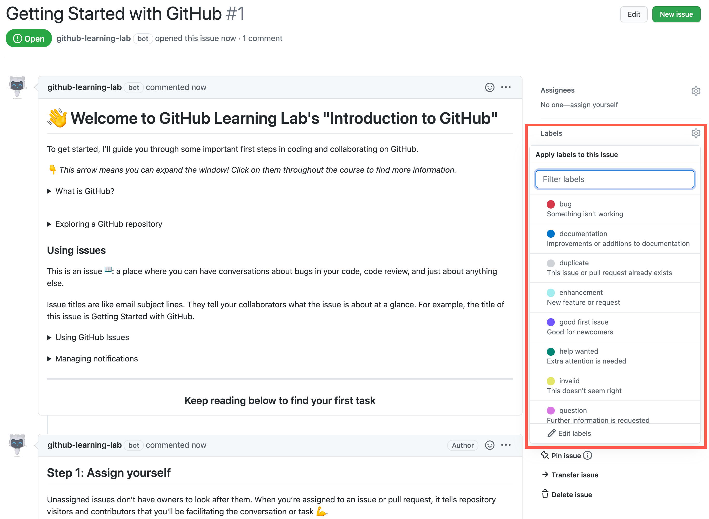

* [Actions](https://docs.github.com/en/free-pro-team@latest/actions/learn-github-actions/introduction-to-github-actions) - provide task automation and workflow functionality in a repository. Actions can be used to streamline processes in your SDLC and implement continuous integration and continuous deployment (CI/CD). GitHub Actions are composed of the following components:
    1. Workflows: Automated processes added to your repository.
    2. Events: An activity that triggers a workflow.
    3. Jobs: A set of steps that execute on a runner.
    4. Steps: A task that can run one or more commands (actions).
    5. Actions: Standalone commands that can be combined into steps. Multiple steps can be combined to create a job.
    6. Runners: Server that has the GitHub Actions runner application installed.
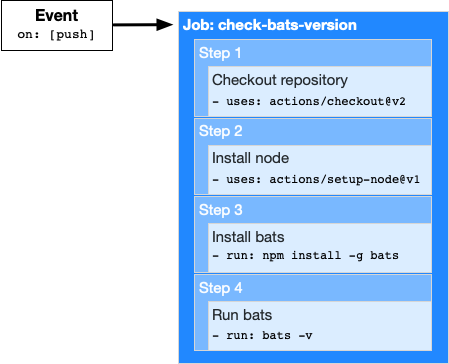

* Cloning a Repository - Cloning a repository will make a copy of the repository and its history on your local machine. 

* [Forking a Repository](https://docs.github.com/en/free-pro-team@latest/github/getting-started-with-github/fork-a-repo) - Forking a repository(upstream) makes a copy of the repository in your GitHub account. To contribute changes back to the upstream repository, you create a pull request from your forked repository. 
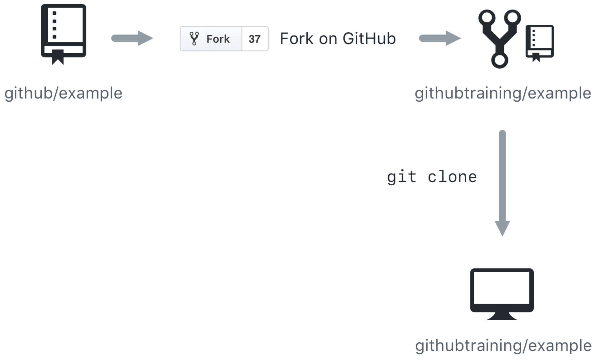
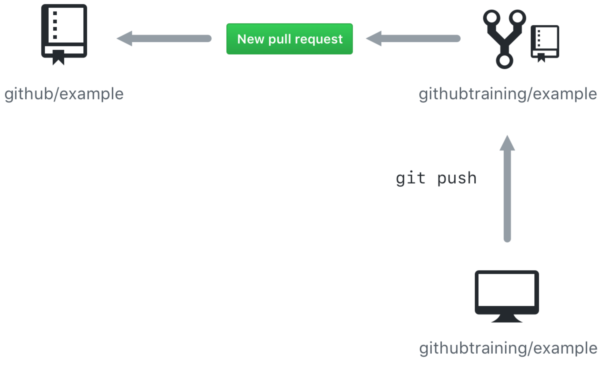

[GitHub Pages](https://pages.github.com/) - is a hosting engine that's built right into your GitHub account. Build your own static site generated from HTML and markdown code pulled directly from your repository.

# Migrating to GitHub
1. Retain version-control history, import using the GitHub Migrator tool.
2. Handling binary files currently stored in your project - Avoid committing large binary files (spreadsheets, presentations) such as build artifacts. Need to version large binary files, consider using the Git LFS (Large File Storage) Git extension
3. Creating important Git files like .gitignore - recursively excludes any folders called Bin or bin
    1. .gitignore
    2. [Bb]in/
4. Importing your project to GitHub - Ready for migration, navigate to the Code tab of your GitHub repository. Use the Import code option to specify the source repository.
* 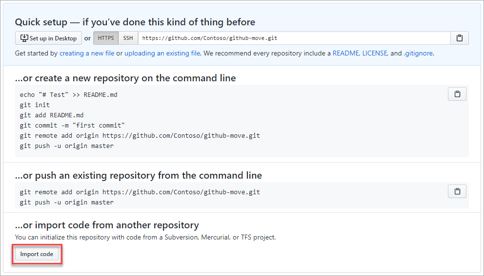
6. The GitHub Migrator tool will take care of the rest.
* 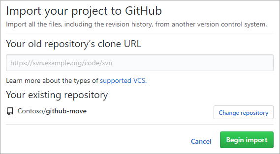

# What are merge conflicts?
* Developer creates a branch named "feature-branch" based off "main" and creates two commits. As this work is happening, someone else merges an unrelated pull request into main. 
* If the feature-branch commits don't overlap with parallel commits made to main since the branch was created, then there will be no problems.
* But if both sets of commits include changes to the same lines of code? This merge attempt would fail due to a <ins>merge conflict</ins>.
* 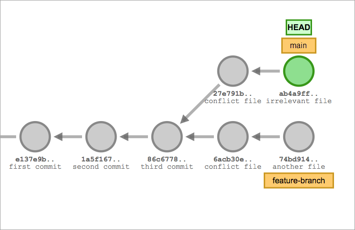
* <ins>What are merge conflicts?</ins> - Developer attempts to merge changes (overwrite parallel). Git won't automatically overwrite, it will point the conflict, so that developer can resolve.
* 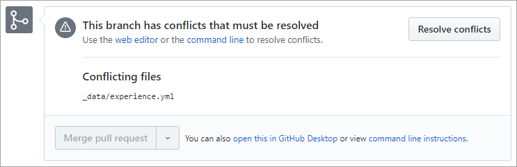
* <ins>Resolving merge conflicts</ins> - GitHub generates a temporary hybrid file that includes the differences from each branch. Cmpare branch is shown above the base branch, separated by a line of equal signs (=======).
* 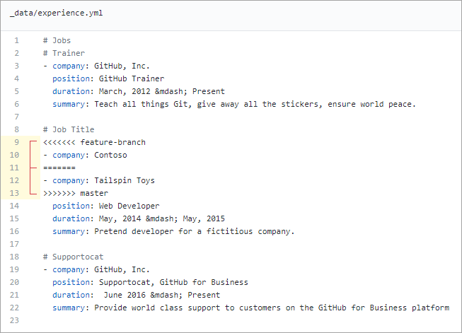
* Directly edit the file if the changes are minor. If you decide to keep the final result, it will be committed to the compare branch.
* Avoiding merge conflicts
    1. Pull early and often
    2. Tidying history with git rebase - "git rebase (or git pull --rebase)" command.

# Searching GitHub
* 2 search methods - the global (top of the page) and the scoped (certain repository).
* Context search - available on certain tabs, such as Issues and Pull requests. 
* 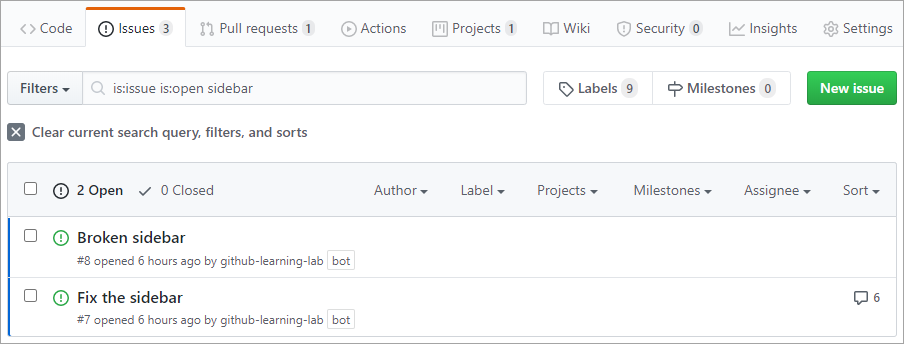
* Filter queries
    1. is:open is:issue assignee:@me - Open issues assigned to the current user (@me)
    2. is:closed is:pr author:contoso - Closed pull requests created by @contoso
    3. is:pr sidebar in:comments	- Pull requests where "sidebar" is mentioned in the comments
    4. is:open is:issue label:bug -linked:pr	- Open issues labeled as bugs that do not have a linked pull request.
* <ins>git blame?</ins> - displays the commit history for a file. To see who made what changes and when. 
* 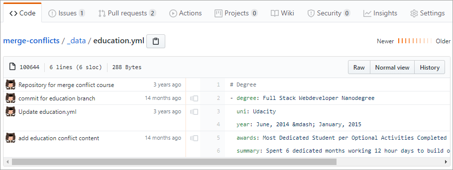
* <ins>Autolinked references</ins> - To make it even easier to cross-link different items throughout your project, GitHub offers a shorthand syntax. For example, if you leave a comment like "Duplicate of #8", GitHub will recognize that #8 is an issue and create the appropriate link for you.
* 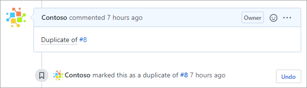
* GitHub also links commits for you if you paste in the first seven or more characters of its ID.
* 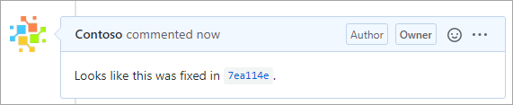
* <ins>Looping in users with @mention</ins> - to associate other people with discussions (using an @mention). 


# InnerSource
* Practice of applying open-source patterns to projects with a limited audience. 
* InnerSource benefits
    1. Transparency. Access to the other company source code. See how different teams solved problems
    2. Reduce friction. Bg fix or new feature by a different team, And if changes can't be merged in for any reason, the consumer team can fork thee project to meet their needs.
    3. standardize practices. 
* repository visibility
    1. <ins>Public</ins>  - visible to everyone. 
    2. <ins>Internal</ins> - visible to members of the org that owns them. Use this visibility for InnerSource projects.
    3. <ins>Private</ins> - visible to the owner, any teams or individuals.
* <ins>Repository permissions Level
    1. <ins>Read level</ins> - non-code contributors who want to view or discuss the project.
    2. <ins>Triage</ins> - contributors, proactively manage issues and pull requests without write access.
    3. <ins>Write level</ins>  - contributors who actively push to the project.
    4. <ins>Maintain level</ins>  - PMs,  manage the repo without access to sensitive or destructive actions.
    5. <ins>Admin level</ins> - people who need full access to the projec.
* To proactively address this issue, GitHub looks for a <ins>CONTRIBUTING.md</ins> file in the root (or /docs or /.github) of a repository. Use this file to explain the contribution policy for the project. 
* Create issue and pull request templates -  Use these to provide the initial description text for a newly created issue or pull request.
* 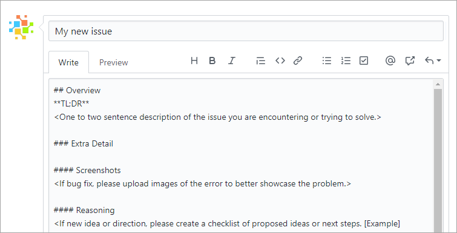
    1. For example, if your project has .github/ISSUE_TEMPLATE.md, anytime a user starts the process of creating an issue, they see this content.

* <ins>Define workflows</ins> - encourage external contributions, be sure to specify what workflow the project follows. The workflow should include details about where and how branches should be used for bugs and features, how pull requests should be opened, and any other details people outside the repository team should know before they push code. If you don't yet have a workflow in mind, you should consider the GitHub flow.

* <ins>Measuring program success</ins> - Traditional metrics like "time to market" and "bugs reported" are still applicable. Adding metrics that show how external participation has improved project quality. Is the repository receiving pull requests from external sources that fix bugs and add features? Are there active participants in discussions around the project and its future? Is the program inspiring an InnerSource expansion that drives benefits elsewhere in the organization?
    1. In short, metrics are hard, especially when it comes to measuring the value and effect of individual and team contributions. 
    2. If misused, metrics can harm the culture, existing processes, and diminish the collective sentiment towards the organization or leadership team. When thinking about measuring InnerSource adoption, consider the following:
        1. Measure process, not output - Code review turnaround time, Pull request size, Work in progress, Time to open
        2. Measure against targets and not absolutes
        4. Measure teams and not individuals - Number of (unique contributors to a project, projects reusing code,  cross-team @mentions).

# Markdown
* ``` *italic* or _italic_ ``` -> *italic* or _italic_
* ``` **bold** or __bold__ ``` -> **bold** or __bold__    
* ``` \_This is all \*\*plain\*\* text\_. ``` -> \_This is all \*\*plain\*\* text\_.   
* ``` ###### This is H6 text ``` - > ###### This is H6 text    
* ```  ``` ->     
* ``` [Link to Microsoft Training](/training) ``` -> [Link to Microsoft Training](/training)
* ```  Ordered list
    1. First
    1. Second
    1. Third
  ```   
    1. First
    1. Second
    1. Third
    
* ``` unordered list
    - First
      - Nested
    - Second
    - Third
  ```  
    - First
      - Nested
    - Second
    - Third
* ``` building tables
    First|Second
    -|-
    1|2
    3|4
  ```
    First|Second
    -|-
    1|2
    3|4
* ``` > This is quoted text. ``` -> > This is quoted text.
* ``` Here is a<br />line break ``` -> Here is a<br />line break
* ``` This is `code`. ``` -> This is `code`.    
* ```
    ```markdown
    var first = 1;
    var second = 2;
    var sum = first + second;
    ```
  ```
  ```markdown
  var first = 1;
  var second = 2;
  var sum = first + second;
  ```
* ```
      ```javascript
      var first = 1;
      var second = 2;
      var sum = first + second;
      ```  
  ```  
  ```javascript
  var first = 1;
  var second = 2;
  var sum = first + second;
  ```  
* ``` Tracking task lists
    - [x] First task
    - [x] Second task
    - [ ] Third task
  ```
  - [x] First task
  - [x] Second task
  - [ ] Third task  

# secure GitHub repository
* Developers looking to report or address security issues look for a [<ins>SECURITY.md</ins>](https://docs.github.com/en/code-security/getting-started/adding-a-security-policy-to-your-repository) file in the root of a repository.
* GitHub Security Advisories allow repository maintainers to privately discuss and fix a security vulnerability in a project.
* Keep sensitive files out of your repository with .gitignore
* <ins>Branch protection rules</ins> - to enforce certain workflows, such as requiring an approving review or passing status checks for all pull requests merged into the protected branch.
* **CODEOWNERS** file to repository, you can assign individual team members or entire teams as code owners to paths in your repository.     
* Detect and fix outdated dependencies with security vulnerabilities
    1. **Repository dependency graphs** - GitHub scans common package manifests, such as package.json, requirements.txt, and others. These graphs allow project owners to recursively track all of the dependencies their project relies on.
    * 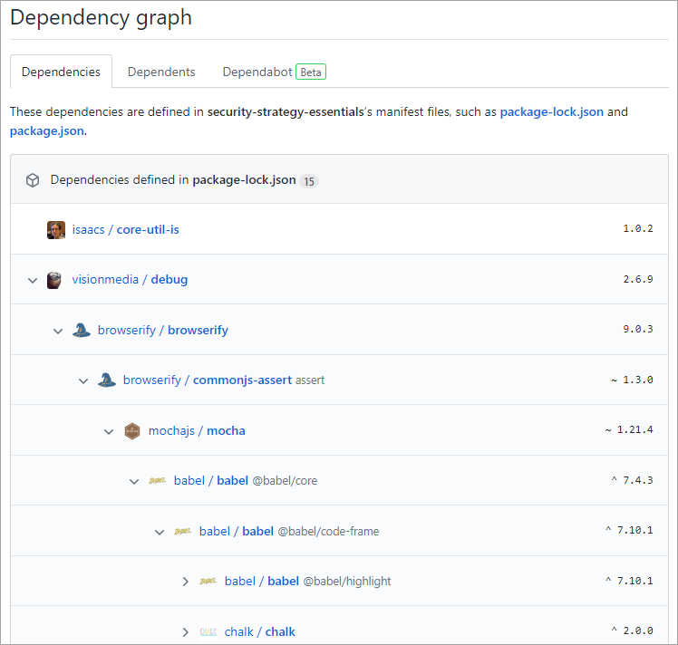
    2. **Automated dependency alerts** - watch your dependency graphs for you.  
    * 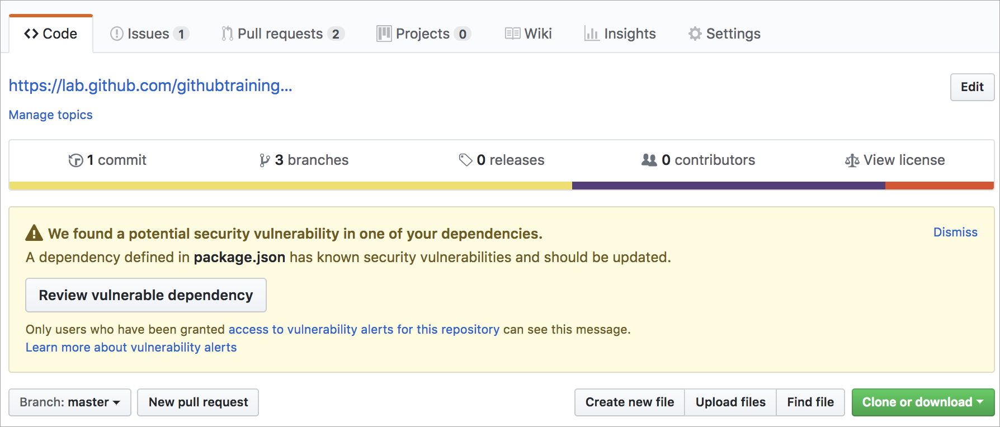
    3. **Automated dependency updates with Dependabot** - It scans for dependency alerts and creates pull requests so that a contributor can validate the update and merge the request. 
    4. **Automated code scanning** - Similar to Dependabot, to analyze and find security vulnerabilities and errors in the code. Use **CodeQL** lets you query code as data, which lets you create custom queries or use queries maintained by the open-source community. Code scanning gives you the freedom to customize and maintain how the code within your repository
    * 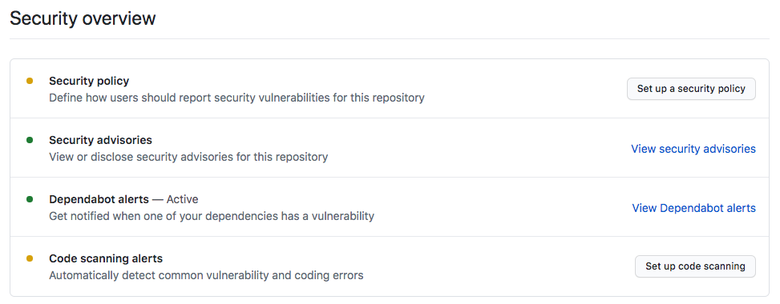
    5. Secret scanning - scanning looks for known secrets or credentials committed within the repository. 

# GitHub Script
* **GitHub Script** - automate common GitHub processes using GitHub Actions workflow
* **GitHub Script** is an action that provides an authenticated **octokit** client and allows JavaScript to be written directly in a workflow file. It runs in Node.js, so you have the power of that platform available when writing scripts.
* **octokit** is the official collection of clients for the GitHub API. One of these clients, rest.js, provides JavaScript access to GitHub's REST interface.
* **What can octokit/rest.js do?** - it can do virtually anything with respect to automating GitHub. 
* 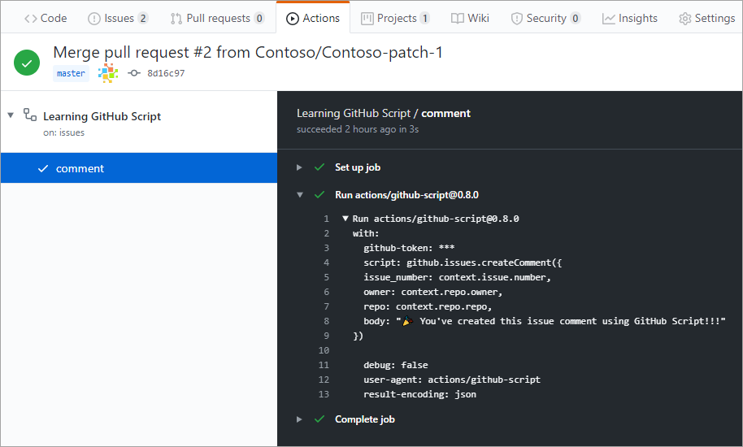

# release based workflow
* A release based workflow is a set of patterns and policies that focuses on releasing software. 
* **sprints** -  In GitHub, managed as projects. The board is the central plan of record for the iteration and contains all of the cards that are to be resolved. A card can represent an issue, a pull request, or even just a generic note. To do -> In Progress -> Done Columns (customizable)
* 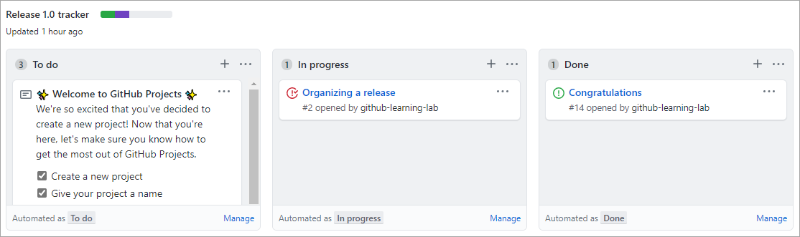
* 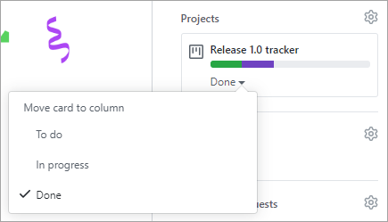
* Tracking specific milestones - prioritized completion of issues and pull requests. a project may be focused on the team's process, a milestone is focused on the product.
* 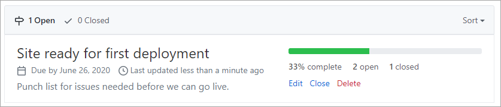    
* 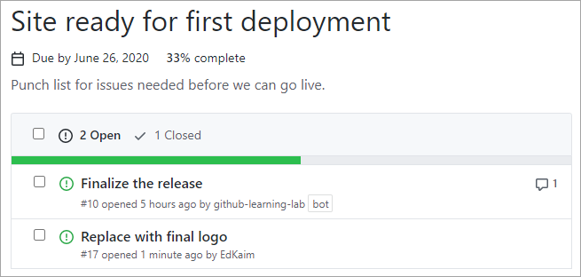 
* **git cherry-pick** - apply specific commits from one branch to another.
* Releasing to consumers - When a product version is ready to be released, GitHub simplifies the process of packaging it up and notifying consumers.
* 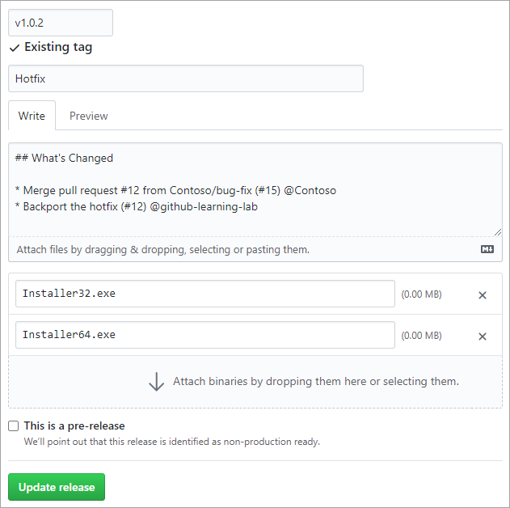   
    

# GitHub Actions
* To create a workflow by using a template. A template has common jobs and steps pre-configured for the particular type of automation you're implementing. 
* main page of your repository, select the **Actions** tab to create a new workflow. 
* 
* 2 examples - Node.js template (clean install of node dependencies, builds the source code and runs tests across different versions of Node). The Python package template (installs Python dependencies,runs tests, including lint, across different versions of Python).  
* Action Logs for the build
* 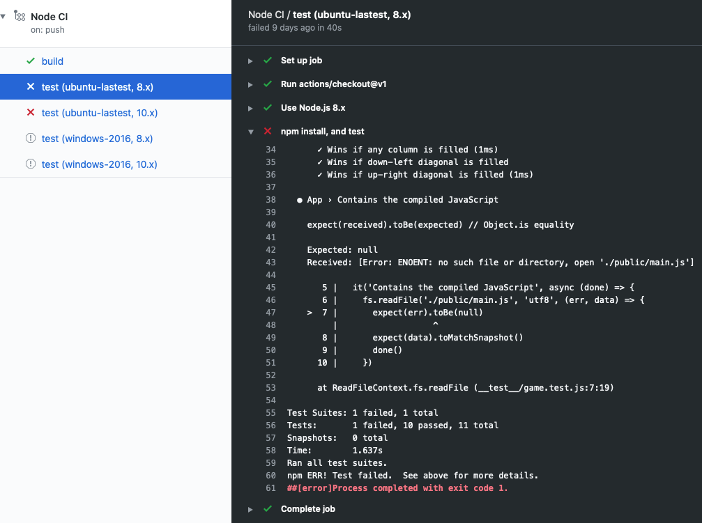
* **artifacts** - when a workflow produces something other than a log entry. For example, the Node.js build will produce a Docker container(artifact). It  can be uploaded by **actions/upload-artifact** and downloaded **actions/download-artifact**. The space is free (public repo) and some amount is free(private). GitHub stores your artifacts for 90 days.
* **Automate reviews in GitHub using workflows** - run the workflow after something a human needs to do. For example, run a workflow after a reviewer has approved the pull request. For this scenario, we can trigger on pull-request-review. Another action, add a label to the pull request.
    

    
